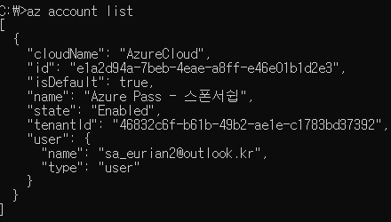

# 191210 Azure Cloud & Load Balancer & VPN

### 109779F Module 2 Module 5

### Cloud 관리하는 방법

1. Visual studio로 연결하여 관리
2. Power Shell에서 직접 관리

### Power Shell 오픈방법

1. 시작 메뉴에서 Windows Power Shell 클릭
2. 실행 창에 `powershell` 입력


## Cloud Shell

> Azure Portal 에서 사용할 수 있는 Shell
>
> Power Shell과 Azure CLI 명령어를 모두 사용할  수 있음

* Cloud shell을 작동하기 위해서는 Shell을 저장하는 Storage 저장소를 만들어야 함

  *한번 만든 후 다음 부터 안 만들어도 됨

* Power Shell과 Bash Shell 모두 사용 가능

* Module 따로 설치할 필요 없음


## Power Shell

> Windows에서 사용 가능한 Shell
>
> Azure portal사이트에 접속하지 않고, 윈도우 운영체제에서 Power Shell을 사용하여 바로 Resource Service를 바로 생성할 수 있음
>
> 명령어가 길고 복잡

#### 명령어 사용 방법

> Google - Microsoft docs 사이트 참고

동사 - 명사로 이루어져 있음

명령 프롬프트 명령어 이용 가능

`Cmdlet` = `Command Let`의 약자 Power Shell의 명령어 의미

`Tab` 자주 사용 ( ex `폴더 앞 첫글자 + Tab` : 현재 폴더 내에서 첫글자가 일치하는 폴더 name print)

`..` 상위폴더

`.` 현재 폴더

```powershell
cd \ #C드라이브로
md PowerShell #PowerSell 폴더 생성
cd .\PowerShell\ #powersell 폴더 접근
cd .. #현재 폴더에서 상위폴더로 이동
dir #현재 폴더안의 폴더 출력
get-command #powershell의 모든 명령어를 출력
get-command > powershell_command.txt # > = ridirection 다음 파일에 저장
get-process #현재 사용되는 모든 프로세스 출력 (작업관리자 - process)
get-module #모든 모듈을 불러옴
ipconfig /all #명령 프롬프트 명령어 (띄어쓰기 주의)
```

### Power Shell ISE

> Power Shell 명령어를 스크립트화 시킬 수 있음
>
> 명령어를 저장하여 재실행할 수 있다

### Power Shell Module

> Power Shell 명령어들의 집합
>
> Power Shell 명령어를 사용하려면 Module을 등록시켜줘야 함\

* 모듈 집합에서 원하는 모듈을 선택하면 해당 프로그램과 관련된 모듈이 나열됨


###### 예시

```powershell
#모듈 import 후 불러오기 - 명령어 사용 가능 해짐
Get-IscsiConnection
Import-Module iscsi
Get-Module
```


### Power Shell - Az 모듈 설치 (최신)

* Power Shell Azure를 사용할 수 있는 모듈을 설치하는 것
* 설치(install)는 한번만 해도 되고 컴퓨터가 리부팅 되면 모듈이 날아가기 때문에 import는 계속 해줘야 함

https://azure.microsoft.com/en-us/downloads

```powershell
Install-Module -Name Az -AllowClobber #Name Az = Azure 모듈 설치
Set-ExecutionPolicy Unrestricted #실행정책 허용
import-module Az.Accounts #모듈 등록
Connect-AzAccount #AzAccount에 대한 인증 절차 필요
Get-AzSubscription #Subscription 확인
Select-AzSubscription -Subscription <Subscription ID> #사용할 Subscription 선택
# Subscription ID : 매우 긴 숫자코드
```


### AzureRM모듈 설치 (예전 - Connect 안됨 사용 X)

```powershell
Install-Module -Name AzureRM -AllowClobber			# 모듈 설치
Import-Module AzureRM 								# 모듈 import
Get-Module											# 모듈 import 여부 확인
Connect-AzureRMAccount
```

* Az Module과 명령어 일치


## Azure CLI

> Windows, MAC, LINUX 에서 사용가능한 Shell
>
> 명령어가 단순하고 짧음

### Azure CLI 설치

https://docs.microsoft.com/ko-kr/cli/azure/install-azure-cli-windows?view=azure-cli-latest

* 위 페이지에서 MSI 혹은 PowerShell 코드로 설치 가능
* 모두 설치 후 명령 프롬프트창에 az 코드 입력
* 로그인 실시 - account set subscription 설정

```bash
> az login				# SubScription이 뜸 (json형식)
> az account list		# 이 list에서 필요한 subscription 코드 다음 코드에 입력
> az account set --subscription <value of the subscription id property
```




### Azure 가상머신 포털

http://docs.microsoft.com/ko-kr/azure/virtual-machines/windows/

* 포털로 VM 만들기 (GUI)

* Power Shell로 VM 만들기 (명령어)

* Azure CLI로 VM 만들기 (명령어)

  = Cloud Shell에서 Power Shell, Azure CLI 모두 바로 사용 가능

  = Cloud Shell 사용 권장

  

###### PowerShell VM 생성과정 (PowerShell ISE에 스크립트로 저장하면 편리)

```Powershell
New-AzResourceGroup -Name myResourceGroup -Location EastUS # 리소스 그룹 만들기
New-AzVm `
    -ResourceGroupName "myResourceGroup" `
    -Name "yhrmyVM" `
    -Location "East US" `
    -VirtualNetworkName "myVnet" `
    -SubnetName "mySubnet" `
    -SecurityGroupName "myNetworkSecurityGroup" `
    -PublicIpAddressName "myPublicIpAddress" `
    -OpenPorts 80,3389						# VM 생성 ** ` 표시는 Enter 구분자 표현 *

# -이 들어간 부분 : Parameter (= Option)
# ""이 들어간 부분 : parameter 값 (공백이 들어갈 때는 반드시 ""로 묶어줘야 함)
# VM에 부여할 계정의 ID와 PW 입력

Get-AzPublicIpAddress -ResourceGroupName "myResourceGroup" | Select "IpAddress"
mstsc /v:<<publicIpAddress>>								# 가상 머신에 연결
# 방화벽 때문에 IP로는 들어갈 수 없고 DNS 이름으로 연결해야 함 / VM 내에서 접속할 때는 IP로도 접속 가능
# :이 있으면 공백없이, :이 없으면 공백 넣기

# 접속한 VM의 PowerShell에서 웹서버 설치 진행하기
Install-WindowsFeature -name Web-Server -IncludeManagementTools # 웹서버 설치
```


###### Azure CLI VM 생성과정

```bash
> az group create --name myResourceGroup1 --location eastus   #리소스 그룹 만들기
> az vm create ^											  # VM 생성
    --resource-group myResourceGroup1 ^
    --name myVM ^
    --image win2016datacenter ^
    --admin-username azureuser ^
    --admin-password Pa1234567w.rd
> az vm open-port --port 80 --resource-group myResourceGroup1 --name myVM
													# 웹 트래픽에 대해 포트 80 열기
# 방화벽 내용이 출력됨
> mstsc /v:<<publicIpAddress>>									   # 원격 접속
# 방화벽 때문에 IP말고 DNS로 연결
```

* 1~3번까지는 Azure에서 예약해놓은 IP - VM 생성시 4~254번까지 IP가 할당됨
  * VM의 Network IP : `10.0.0.0`
  * VM의 Broadcast IP : `10.0.0.255`


* VM연결 후 VM에서 PowerShell 오픈

```powershell
Install-WindowsFeature -name Web-Server -IncludeManagementTools		# 웹 서버 설치
```

* Host에서 VM의 DNS서버 url에 넣어 접속 확인


## Azure Load Balancer

> 부하 분산 장치
>
> Network Security Group L4에 있는 방화벽
>
> Application Gateway L7에 있는 방화벽

* TCP 80 = Web Service
* TCP 443 = https = 보안이 있는 웹서비스
* TCP 3389 = 원격 접속 시 로드밸런서
* 로드밸런서 세팅 시 포트 지정 : 특정 포트로 들어오는 패킷에 한해 부하 분산 처리를 함
* 사용자가 들어오면 캐치해서 각 VM으로 보내줌


### Load Balancer Setting


* Frontend IP configuration

  > 로드밸런서에서 클라이언트가 접속하는 IP 대역

* Backend pool

  > VM들 / 로드밸런서가 처리하는 부하 분산 처리할 대상

* Probes

  > Backend pool 이 살았는지 죽었는지 감시하는 것 (부하 분산 처리를 받아도 되는지)
  >
  > Backend pool을 세팅하게 됨

* LB rules

  > 어떤 특정 IP포트(3389, 80...)에 대해 부하분산처리를 할지 설정

* Inbound NAT rules

  > 사설 IP를 공인 IP로 변환


## VPN

### 20533E Module 2

*사설 IP => 회사망(Private)에서 ERP 사용*

*집에서 ERP접속할 수 있을까? NO!*

*하지만 접속해야 한다면  VPN을 이용 하자*

>Virtual Private Network
>
>원격에서 회사 네트워크 접근
>
>VPN 서버에 접속하면 집에 있는 컴퓨터와 회사망 사이에 터널을 뚫어 집 컴퓨터로 회사망에 들어갈 수 있게 만들어줌

* 터널링 기술 사용 

  

### 터널링 기술

> 데이터 스트림을 인터넷 상에서 가상의 파이프를 통해 전달시키는 기술

* PPTP (X)

* L2TP / IPSec : 방화벽을 많이 열어줘야 함

  > **IPSec**
  >
  > 암호화하는 기술

* SSTP : TCP 443포트 (SSL)

* IKEv2 : 세션을 서버에서 자동으로 접속

  * 세션이 끊길 경우 서버에서 클라이언트로 다시 자동으로 세션을 맺기 때문에 클라이언트는 세션이 끊겼는지 잘 알 수 없음
  
  

## VPN의 종류

**Azure : 관리창 (54개의 데이터센터에서 146개의 서비스 제공)

### P2S VPN connectivity

> Point to site
>
> 회사라는 거대한 사이트 망에 내 컴퓨터 한대가 접속하는 것

### Site to Site VPN

> 본사 회사 망 라우터 장비와 지사 회사 망 라우터 장비 즉, 두 네트워크가 같은 네트워크에 있는 것처럼 접속 
>
> 라우터 장비 또는 VPN 장비
>
> 사용자가 따로 연결할 필요가 없음

### VNet to VNet VPN (1문제 출제)

> VNet과 VNet을 연결하여 하나의 네트워크 처럼 이용


**Azure : 관리창 (54개의 데이터센터에서 146개의 서비스 제공)

* 내 컴퓨터 - VNet에 연결 : 내 컴퓨터가 Azure VPN을 통해 VNet 환경으로 접속 = **Point to Site**

* 회사 네트워크(On - premises network) : 라우터 (or VPN) 장비에서 Azure VNet 환경으로 접속

  = **Site to Site**

* East US Vnet1 - East US Vnet2 : 같은 데이터 센터 내의 VNet과 VNet을 연결 = **Peering**

* West US Vnet - East US Vnet : 다른 데이터 센터의 Vnet과 Vnet을 연결 = **VNet to VNet**

* 회사 네트워크 - Azure 간의 전용선 형성 : **ExpressRoute** (매우 빠름)


## VM Availability Set (1문제)

### 10979F Module 3

> Azure portal - availability option

* Availability = 가용성

  > 서비스를 유지하는 것 (죽지 않도록 하는 것)
  >
  > 서비스에 문제가 발생하더라도 서비스를 계속 유지하게 함

* Availability Zone

  * 복제 범위 : DataCenter 간의 복제
  * 어떠한 DataCenter가 문제가 생겼을 때 다른 DataCenter가 서비스하는 것
  * 99.999%의 SLA가 보장됨 (Five 9의 SLA) 
  * 1년에 5분 정도의 downtime - 이 이상 문제가 발생하면 보장해줌

  > **SLA**
  >
  > Survice 유지 퍼센트

* Availability Set

  * 복제 범위 : 같은 데이터 센터 안의 Lack간 복제 (Server Box)
  * 한 Lack에 저장된 데이터를 같은 데이터 센터 안의 다른 Lack에 복제해 서비스하는 것
  * fault domain (=Lack) (3 fault domain = Lack 3개에 분산 저장하겠다)
  * update domain (20 update domain = VM 20개를 생성하겠다)
  * 99.95% SLA 보장

* Standalone VMs

  * Avaiulability를 설정하지 않은 일반 VM
  * 99% SLA 보장