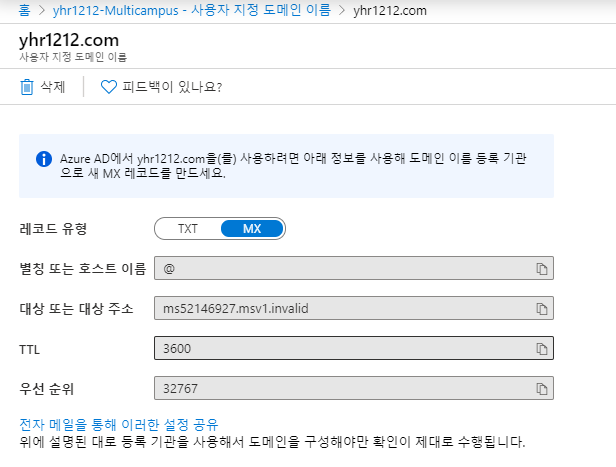

# 191212 Azure AAD, DNS

## Azure AAD (Azure Active Directory)

###### 참조 : 6425C_01-Active Directory pdf

### Active Directory

> **MS Directory Service** (마이크로소프트의 디렉토리 서비스)\
>
> 각 컴퓨터에 계정을 만들어놓는 것이 아니라 중앙 컴퓨터에 계정이나 그룹 등의 보안에 대한 정보를 한 네트워크 컴퓨터에 저장해놓는 것
>
> 네트워크에 있는 정보를 공유해서 사용

* Directory Service 

  > 네트워크 정보를 중앙에 저장하고 사용하는 것
  >
  > X.500 = Directory Service의 표준 (IBM, SUN (EMC - DEL로 합병)...
  >
  > DAP (디렉토리 서비스에 접근하는 프로토콜)

* 기존의 복잡한 directory service를 일반인들도 구현하기 쉽게 MS에서 제작한 directory service가 Active Directory - DAP을 LDAP(dap을 간략하게 변경)로

* 각각의 컴퓨터가 각각 보안되는 것이 아니라 하나의 보안을 만듦

  **Domain**

  > Directory Service가 작동되는 바운더리
  >
  > 하나의 보안단위로 grouping 된 것 (단일 보안)

  * SSO (Single Sign On) - 중앙 컴퓨터에 한번 로그온 하여 토큰을 부여받아 네트워크에 있는 서비스에 별도의 인증 없이 접근 가능한 것

  * 중, 대규모 네트워크 환경

  * **DC (Domain Controller)** 에서 인증(Authentication), 허가(Authorization)

    > Active Directory 서비스가 구현된 컨트롤러

    **DC 필수

    * Credential : Identity(ID) + Password(PW)를 통칭

      * Workgroup : SAM(WorkGroup 계정 모든 정보 등록되어 있음) 파일에서 인증 (Windows - System32 - config-SAM)

        > 컴퓨터 관리 - 로컬 사용자 및 그룹 에서 계정 설정 가능 (compmgmt.msc)

      * Domain : DC에서 인증 (NTDS.DIT : 도메인 계정에 관련된 것 모두 등록되어 있음)

    * 일반 계정에는 허가를 따로 받지 않음, but 관리계정에는 백업 등 관리권한을 부여받음

  * 중앙화된 관리 (GPO)

  * △ : 도메인 환경

  * 도메인 환경에는 DC 컴퓨터가 반드시 있어야 함 

  * DC - server 운영체제 Active Directory Domain Service 설치 / 계정 생성

  * multi.com - 같은 도메인 환경에 있다는 표시

  * 네트워크에 있는 컴퓨터들은 DC에 저장된 계정으로 보안 설정함

  * 네트워크가 접근할 때 DC에서 인증을 받고 각 컴퓨터에서는 별도의 인증창 없이 로그온 함

  **WorkGroup**

  > 각각의 시스템이 보안단위

  * 소규모 네트워크 환경에서 사용 (20대 미만)

  * 각자의 시스템에서 인증처리

  * 기본으로 설정됨

  * 파일, 폴더에 모두 인증이 걸려있음(DACL) - 네트워크가 이 파일, 폴더에 접근하려면 해당 컴퓨터의 ID PW로 인증을 받아야 함 (각각의 컴퓨터에 매번 인증을 받아야 함)

    **보안**

    * DACL : 파일 접근 할 수 있을 지 없을지 권한을 관리하는 것 (= **ACL**)

      ​			상속된 권한은 제거할 수 없음 (+ 권한 추가는 가능)

      ​			상속된 권한을 제거 - 고급 보안에서 상속 사용 안함을 선택

    * SACL : 감사 (누가 언제 파일을 열어 어떤 행동을 했는지 기록)

    **토큰**

    > 인증을 받은 후에 토큰이 부여되어 저장됨 (로그온하면 만들어짐)

    

    	- SID : 계정의 고유 번호 (실제로 이것으로 계정을 구분) - 시드정보 확인 안되면 접근이 차단됨
    	- Privileges : 권한 할당 *토큰에 권한이 있는지 확인 한 후 백업, 종료 하기
    	- Other access information

#### Active Directory 에서 제공하는 서비스

##### 1. Active Directory Domain Service (AD DS)

> 인증과 허가를 하는 서비스
>
> 가장 기본이 되어야 함
>
> AD DS가 설정되어 있는 컴퓨터 DC

##### 2. Active Directory Lightweights Domain (AD LD)

> directory service의 간략한 정보가 담김

##### 3. Active Directory Certification Services (AD CS)

> 인증서

##### 4. Active Directory Right Management Services (AD RMS)

> 권한 관리 서비스

##### 5. Active Directory Federation Service (AD FS)

> 기본 설정이면 DC이 타 도메인에서 접근할 수 있도록 인증계정을 만들어둬야 함
>
> BUT 도메인(DC)과 도메인(DC) 사이에 접근할 때 federation 서비스를 맺으면 A회사에서 인증받은 사용자가 B회사에서 인증받을 필요 없이 이용할 수 있음
>
> 타 회사와의 Single Sign On 을 시행
>
> ex Azure에 있는 146개의 서비스는 모두 보안이 걸려져 있기 때문에 Azure Active Directory에 아이디와 패스워드를 만들어 저장해야 함 BUT 회사의 Active Directory와 Azure Active Directory가 AD FS를 맺으면 별도의 인증 없이 모든 서비스를 이용할 수 있음

### AAD (Azure Active Directory)
* 디렉토리는 추가 생성 가능 - Create a directory
* Tenant : 하나의 보안단위 / 각각의 Tenant마다 계정을 만들 수 있음
* 디렉토리가 변경되면 메뉴구성이 달라짐

#### Directory 생성

1. Create a Directory

2. Configuration

   - Organization name : 회사명 (조직명)

   - **Initial domain name** : Tenant ID (AAD계정)@Initial domain name(azure에서 제공해주는 domain.onmicrosoft.com)

     DNS를 이용하면 회사 도메인 명으로 변경 가능

   - Country/Region : 어느 데이터센터에 AAD를 생성할 것인지 설정

   

3. Review - Create
4. 상단 - Directory + subscription 에서 생성 확인 가능

#### User 추가 생성

1. User - New User - Create User (하나의 테넌트)

2. ID - User name - Name 채우기

3. Auto generate password 또는 Let me create the password 중 선택 (수업 let me)

4. Groups and roles - 관리를 쉽게하기 위해 그룹핑 하는 경우 있음 (수업 no)

   * Global administrator 를 선택하면 모든 권한을 줄 수 있음 (account administrator 제외)
   * 역할을 할당하려면 과금이 되어야 하기 때문에 AD Premium P1 P2로 업그레이드되어야 함

   * ARM의 특징 때문에 선택가능

   * User로 선택하는 경우 서비스 사용자 권한 외에는 아무 권한도 없음

     **Azure version**

     1. **ARM** (**특징 시험에!**) 

        > classic에서 resource단위로 쪼개는 것 확장이 쉬워짐 (Microservice의 특징)

        * 태그기능 지원
        * 태그가 붙은 리소스만 쉽게 gathering해서 사용할 수 있음
        * RBAC의 모든 기능 지원

        > **RBAC**
        >
        > Role base access control
        >
        > 역할 기반 접근 제어
        >
        > 컴퓨터 시스템 보안에서 권한이 있는 사용자들에게 시스템 접근을 통제하는 한 방법
        >
        > 1. 역할 할당
        > 2. 역할 권한 부여
        > 3. 권한 부여

     2. Classic

5. Setting

   - Block Sign in : Yes 선택시 로그온 할 수 없도록 차단 가능
   - Usage location : 지정하면 특정 데이터 센터에만 권한을 적용할 수 있음

6. Job info

   * Job title : 과장
   * Department : IT부서

#### New User 로그인 확인

1. ID : (생성한 유저 name)@multicampus136.onmicrosoft.com

   PW 입력 후 로그인

2. UserA (Global administrator 권한 부여한 user)로 로그인하는 경우 서비스를 만들어 낼 수 있음

#### Subscription 설정

> 새로운 Directory에는 Subscription설정이 되어있지 않아서 서비스를 이용할 수 없음
>
> 기본 디렉토리에서 변경하여 Subscription을 할당해줘야 함

1. Home - Subscription
2. Overview - Change Directory - Directory 명 선택

* Access Control (IAD) : AD에 있는 계정이 이 서비스를 사용할 수 있도록 권한을 부여해주는 것
* Subscription은 하나의 디렉토리만 적용 가능
* 디렉토리는 여러개의 Subscription이 적용될 수 있다.

#### Directory 이동 후 역할 할당 추가

* Subscription - Access Control (IAD) - add - Add role assignment - select role
* owner의  경우 전체 관리자 권한을 주는 것 (everything)
* 할당할 구성원 선택 후 save

#### MFA

> Multi Factor Authentication
>
> 다단계 인증 
>
> ID와 PW가 유출되더라도 한번 더 인증을 확인하여 보안을 강화하는 것

* 메세지, 메일, 전화 등등 의 방법을 사용할 수 있음

1. ADD - User - 유저선택 - Authentication methods
2. 전화번호 메일 입력후 save

* Free 버전에서는 작동하지 않을 수 있음

## Azure DNS

##### 참조 20410D_07-DNS pdf

> Microsoft Azure 인프라를 사용하여 이름 확인을 제공하는 DNS 도메인에 대한 호스팅 서비스
>
> Azure에 도메인을 호스트하면 다른 Azure 서비스와 동일한 자격 증명, API, 도구 및 대금 청구를 사용하여 DNS 레코드 관리 가능

### Azure DNS 기능

1. 역할 기반 액세스 제어 : 조직에서 특정 작업에 액세스하는 사람을 제어 할 수 있음
2. 활동 로그 : 문제를 해결할 때 사용자가 리소스를 수정한 방법, 시간 등을 모니터링하거나 오류를 찾을 수 있음
3. 리소스 잠금 : 구독, 리소스 그룹 또는 리소스를 잠궈 다른 사용자가 실수로 리소스를 삭제하거나 수정하는 것을 방지

### DNS 정의 & 역할

> Domain Name System
>
> 영문으로 된 FQDN(전체 컴퓨터 이름)을 IP Address로 변환 (114 역할) (A레코드)
>
> 서비스의 위치 정보검색 /Domain Controller or Global Catalog server 의 위치 알 수 있음 (GPS 네비게이션 역할) (SVR 레코드)
>
> IP Address를 Host name(FQDN)으로 변환해주기도 함 (PTR 레코드)
>
> 메일 서버 위치를 가르쳐줌 (MX 레코드)

* FQDN (Fully Qualified Domain Name)

  * www.naver.com =>  `www `(Host name) + `naver ` (Domain Name) + `com`(Top)
* 네트워크 ID = 그 회사 네트워크 자체 = domain name
  * HOST ID = 네트워크에 있는 각각의 컴퓨터 = 컴퓨터 서버 이름
    * 중복되면 안됨
    * www : www라는 이름을 가진 컴퓨터(서버) 이름 (Word Wide web)
    * smtp
    * pop3
    * ftp
  * 전체 주소 도메인 네임 
  
  [전세계 도메인 관리 사이트 Internic][https://www.internic.net]

  [한국 도메인 관리사이트 doregi][www.doregi.com]

  

* www.naver.com의 IP 주소 = 210.89.164.90

#### Query

* **Recursive Query** : DNS Client가 보내는 도메인 url을 보내고 IP를 요구하는 것

  Complete answer을 요구함

* **Interactive Query** : DNS Server가 인터넷 망을 돌아다니며 값을 가져올 때, DNS Server가 DNS Server에게 물어보는 것 (정확한 답변 요구 아님 "아는데 까지 얘기해줘" - 참조용 정보)

1. Domain 이름 url의 IP가 무엇인지 의뢰

2. Local DNS Server = TCP/IP DNS Server

3. 인터넷 망에 있는 DNS 서버를 뒤져서 IP address를 찾아옴

   ex ) mail1.contoso.com

   - Root DNS server (root DNS - com, org, net, kr 위치만 가지고 있음)
   - .com DNS server (.com DNS - com 밑의 contoso dns 서버 위치를 가지고 있음)
   - contoso.com 에서 도메인 이름에 대한 IP를 가지고 있고 Authoritative response 권한이 있는 대답을 해줌

4. 사용자에게 알려줌

#### 이름 풀이 Client Resolution

> Host 이름을 IP Address로 변환하는 전체적인 과정

1. DNS Cache (hosts)
2. Local DNS

www.naver.com 입력 > Local Host Name 확인(자기컴퓨터인지 확인) >  Host file에 등록된 값이 Cache로 load가 됨(캐시 정보확인) > TCP/IP에 등록된 DNS 서버에 확인 > LLMNR 작동 > Net BIOS Name 작동 > WINS Server 작동 > Broadcast > LMHosts File (여기까지 못찾으면 오류 메세지 출력)

* **ipconfig /displaydns** : dns서버에 Cache(메모리에 있는 내용)를 보는 명령어

* **ipconfig /flushdns** :  DNS Cache를 삭제

* **Cache를 썼을 때**

  > 한번 할당받아온 도메인 값은 Cache로 저장되고 TTL시간 후에 사라짐
  >
  > Hosts에 등록된 도메인, 한번 할당 받아와 메모리에 저장된 도메인이 Cache로 찾아짐

  1. 장점 : 서버의 부하를 줄여줄 수 있음 (서버 부하 감소)
  2. 단점 : 부정확한 값을 받아갈 수 있음

  *Hosts => C드라이브 > windows > System32 > drivers > etc

  ##### Phishing

  > 위 파일에 IP를 입력하고 이름을 설정하면 내가 설정하는 이름을 입력해도 기존 등록된 IP를 불러와줌

#### DNS server IP의 역할

> 영문 URL을 입력하면 DNS서버가 이 도메인 이름을 사용하는 컴퓨터 IP로 변환하여줌

* DNS server IP가 없으면?

  : 영문 url로는 서비스를 받을 수 없고, 사이트 IP로만 접속할 수 있음
  
  

### DNS Zone 

> DNS Database = Zone
>
> DNS 레코드를 호스트하는 데 사용됨
>
> Zone 안에 Record가 있음 (Zone은 Record를 담는 폴더 역할)
>
> Record는 실제로 일하는 것들

#### DNS Zone 종류

1. Forward lookup zone

   A -> IP

2. Reverse lookup zone

   IP -> A

#### Record

1. SOA : 권한의 시작
2. NS :  Name Server를 지정
3. A :  Host Name ==> IPv4 Address로 매핑
4. CNAME : Host Name을 다른 Host Name로 매핑
5. SVR : Service 의 위치 정보를 알려줌
6. PTR : IP Address == Host Name로 매핑
7. AAAA :  Host Name를 ==> IPv6 Address로 매핑
8. **MX : 메일 서버를 지정**
9. **TXT : 특정 서버를 지정**

*도메인을 구매했다고 가정 (작동 안될 수 있음)

*도메인을 우선 신청 후 생성

#### DNS Zone 생성

1. DNS Zone - add

2. name 부분에 www와 같은 Host name은 넣지 않음
3. create

* Name Server = NS (Azure DNS Server 정보)
  * 등록할 도메인이 제대로 작동하기 위해서는 name server를 도메인 신청 시 연결해줘야 함
    * 도메인 신청 시 1차네임서버, 2차네임서버 부분이 있음
    * 이부분에 name server를 매칭해서 넣어줘야 함
  * 설정이 완료되면 글로벌하게 연결됨

#### Active Directory에서 custom domain 설정

Active Directory - Custom domain names

회사이름 도메인을 매칭시켜 줄 수 있음

1. Create Domain - DNS Zone에 생성한 도메인 이름 넣고 Create

* **TXT 레코드 / MX 레코드 를 모두 설정**을 해야 도메인을 제대로 변경하여 사용할 수 있음

* Destination or Points to address에 있는 문자를 세팅할 때 넣어줘야 함

  ex **TXT** (@ MS=ms52146927 3600 32767)

  ​	**MX** (@ ms52146927.msv1.invalid 3600 32767)

  **TTL 값 만큼 메모리에 있다가 그 이상이 되면 메모리에서 사라짐 (Cache가 사라짐)

* Record set 생성단계로 넘어가기

#### Record 생성

> 도메인 이름 앞을 채워줌

1. DNS Zone - 도메인 선택 후 Record Set
2. TXT레코드와 MX레코드를 찾아 위에서 확인한 값을 각각 넣어주기

** 신청된 도메인이 아니기 때문에 확인되지 않음으로 상태가 뜸

* 도메인이 잘 연동이 되면 연동한 도메인을 선택할 수 있게 뜸

  