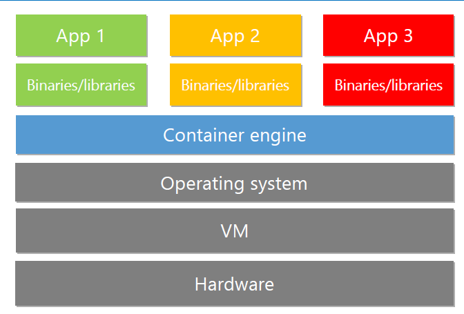

# 191213 Azure ACS, AKS, Docker

## Azure Directory 추가 정리

*Direcory는 각각의 보안단위 - 따라서 계정을 Directory마다 만들 수 있다. - Tenent

*한 Subscription은 하나의 Directory만 가질 수 있음

*Directory는 여러 Subscription을 가질 수 있음

*Azure - Azure AD Premium P2로 변경하면 MFA가 가능

​	Azure active directory - Users - user 선택 후  Authentication methods - MFA 설정 후 	save

### 그룹 생성

1. Azure Active Directory - Group - New Group
2. Security or Office 365 설정 선택 (Security) - 이름, 설명 설정
3. membership type 선택 (RBAC 할당했기 때문에 - assigned)
4. owner 선택 : 계정을 만들거나 추가하거나 할 수 있음
5. member 선택
   

## DNS 추가 정리

### IAM (Identity and Access Management)

DNS Zone - IAM - add role assignment

*그룹은 액세스 관리를 효과적으로 할 때 유용 -> 그룹을 선택하여 역할을 추가하면 role이 그룹 전체에 부여됨

*모든 서비스는 RBAC임 (Role Base로 관리됨)

*ARM - full RBAC 지원

*Classic - limit RBAC (제한된 RBAC) 지원

### Record 생성

1. Overview - Record Set - Add record set

   

2. www.yhr1213.com으로 들어가면 10.10.10.10 IP에 할당된 곳으로 연결됨
3. **A레코드** - Host name을 IP로 연결 시켜주는 것 (www -> 10.10.10.10으로 연결시켜줌)

4. **CNAME 레코드**

   

   - 도메인에 짧은 이름을 넣었을 때, Alias(별칭)에 지정한 긴 이름으로 연결
   - A레코드로 똑같은 효과를 넣고자하면 해당하는 IP 를 입력
   - storage 등의 부분은 IP가 mapping 되지 않으므로 주의!

## Azure Container Service (ACS)

##### 참조 10979F Module 7 (ACS) pdf / Github 10979F instruction module 7

> Docker = Container

### 기본용어 (시험문제)

#### Docker  Engine

- 하드웨어 위에 올라가 컨테이너를 작동시켜주는 역할을 하는 엔진
- 하드웨어 리소스를 공유해서 사용할 수 있도록 처리해줌
- Docker 엔진 위에 container가 올라감

#### Image

* 컨테이너가 실행되어 메모리로 올라가기 이전 이미지 형태로 되어 있는 docker

#### Docker Registry

* Docker Image를 저장하고 있는 저장소

1. Public Registry : 

   [Docker hub](https://hub.docker.com/)에 만들어 놓은 컨테이너들처럼 누구나 다운 받을 수 있도록 공유되어 있는 레지스트리

2. Private Registry

   특정 사용자만 접근하여 사용할 수 있도록 설정한 레지스트리

#### Docker file

* 레지스트리에 있는 도커 이미지를 로컬에 다운 받았지만 아직 실행되지 않은 상태

#### Container (Docker Container)

* 도커 이미지가 메모리(RAM)에서 작동되어 **실행되고 있는 상태**의 Docker Program
* Docker 이미지(도커 컨테이너가 **작동되지 않은 상태**로 메모리에 저장되어 있는 것) => 레지스트리 => 실행됨 => Docker Container

*VM에 Operation System 포함 (그림이 조금 잘못 표현되었음)

- APP + Binaries / libraries = Container
- 개발된 런타임, 개발 언어가 함께 작동되어 메모리 위에 올라가 app으로 표현되는 상태 = Container
- Container engine : Window, Linux 모두 존재
- 어느 OS에서 개발하던 Docker만 있으면 클라우드에서까지도 작동이 됨
- Docker 엔진이 아닌경우 : APP만 배포를 한 경우 => 작동이 안되므로 자신이 개발한 로컬 환경을 서버에도 그대로 구현해주어야 함
- **Docker Container** : 개발밑단에서 작동되는 개발한 환경세팅을 하나로 묶어서 목적지가 어디든 상관없이 Docker Engine만 구현되어 있으면 동일하게 작동될 수 있게 함 (프로그램계의 혁신 - 최근 도커베이스로 개발이 많아지고 있음)
  - 하드웨어 위에 바로 container engine이 올라가 있기 때문에 매우 가볍고 배포가 빠름 (그림은 좀 옛날) - VM이 없음
  - end user는 app을 사용하는 것 => docker를 통해 app자체가 훨씬 가벼워져서 사용하기 편리해짐 앞으로는 hardware도 도커엔진이 대체할 것 os 명령어들을 알 필요가 없어짐

### Docker Compose

> 많은 컨테이너를  docker-compose.yml이라는 파일에 스크립트로 묶어 docker-compose up이라는 명령어를 입력하면 위 파일이 작동되어 안에 있는 스크립트가 작동, 한꺼번에 컨테이너가 실행됨

설치 -> docker-compose.yml 파일 생성 -> docker-compose up 명령어 입력

#### 설치

(Github 20533 module 7 instruction - Exercise 2)

### Doker 명령어 (문제)

(20533E-07 11page)

* `docker login` : registry에 ID/PW로 인증받기

* `docker pull ` : reigstry에 있는 docker image를 내 컴퓨터로 다운

* `docker tag` : image 버전 정보입력

* `docker push` : 내 컴퓨터의 docker file을 image로 registry에 업로드

* `docker pull` or `docker run` : run은 다운 받아 바로 실행 (pull 역할이 합쳐져 있음) 바로 컨테이너를 올리게 됨

* `docker rmi` / `docker rm`

  1) `docker rm` : 실행 중인 **컨테이너** 삭제

  2) `docker rmi` : docker **image**를 삭제

* `docker ps` : 컨테이너가 작동되고 있는지 확인하는 명령어 (process 확인)

* `docker commit` : 이미지 새로 생성

## Azure Kubernetes Service (AKS)

##### 참조 20533E Module 7 (AKS) pdf / Github 10979F instruction module 7

> Docker engine의 호스트 리소스를 전반적으로 컨트롤
>
> 모니터링하여 하나의 컨테이너에 사용자가 몰리게되면 컨테이너를 복사하여 늘리는 부하 분산 처리 진행

* 컨테이너는 VM 복사하는 것(밑단까지 다 복사됨) 보다 용량이 작음 -> 복사가 빠르게 이루어짐

* 가상화 보다 컨테이너가 더 elastic하고 가벼움!

* master node, work node 등 node 세개가 갖춰져야 실행 가능

* node 들이 그룹화 되어 있어야 함 (cluster)

  -> 한 노드가 오류가 나면 오류난 서버에 있는 컨테이너를 다른 노드로 옮김

  -> 그룹화 필요