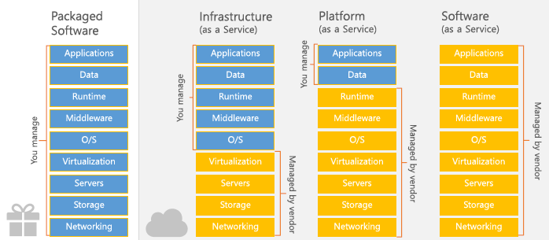
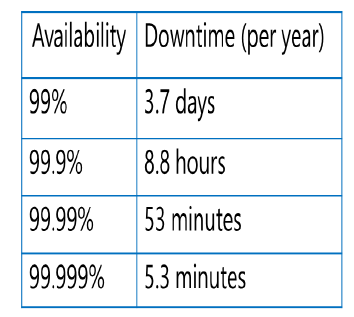

# Azure 시험 Review

16일 월요일 1시 (30분 정도)


## Cloud Computing

##### 참조 클라우드 인프라 - 멀티캠퍼스 pdf

> **네트워크를 통해서 받는** 모든 서비스
>
> 컴퓨터가 아닌 Cloud라는 플랫폼 안에서 모든 서비스를 처리함 -> 결과값만 받아옴

### 중요 Point!	Web browser을 사용한다

**크롬**(클라우드 컴퓨터에 기본적으로 접속), 인터넷 익스플로러, 엣지(마이크로소프트), 사파리, 모질라 파이어폭스 오페라 등

### Cloud Computing의 종류

1. Public : IT Vendor에서 제공하는 Cloud (Amazone, MS-Azure, Google-GCP, Oracle 등) - Global함
2. Private : on-premiss(회사 네트워크 환경) 데이터 센터의 Cloud 
   * On-premiss의 data 서비스는 Elastic하지 않기 때문에 Cloud환경으로 리모델링 함 => Hyper V
   * Hyper V -> OS(가상화) -> SC (System Center)이 resource를 신축성 있게 중앙에서 컨트롤 (MS에서 제공)
   * VM 으로도 가상화 가능
     1. Vspher vCenter(중앙 컨트롤하는 MS의 SC) / ESX(하드웨어를 가상화 시키는 Hyper viser)
     2. Open Stack - Linux 운영체제의 KV를 사용 무료로 데이터 센터 가상화 가능
3. Hybrid : Public 클라우드와 Private클라우드를 모두 사용가능

### Cloud Computing의 특징

1. **Elastic** : 신축성이 있어야함

2. Resource(데이터 센터에 있는 실제 일을 하는 부분)를 기반으로 작동해야 함

   = Resource Pull (*Elastic해지는 기본 조건) = **Scsalable**

   > **Resource**
   >
   > 데이터 안에 파일을 관리하는 폴더
   >
   > 리소스 

   * Resource가 Pulling되기 위해서는?

     각 서버, 스토리지, 네트워크가 가상화 되어 있어야 함

     ​	서버 :

     ​	스토리지 : Vset

     ​	네트워크 : NSX
   
3. On demand Self **Service** : 원하는 서비스를 선택해 만들어 사용

   이미 클라우드 안에는 많은 서비스가 개발되어 있음

4. Broad **Network** access : 네트워크를 통해서 사용 (**Internet Technology**)

5. Lower perational expenses : On-premiss환경보다 운영관리 비용이 저렴

   > On premiss 환경에서 서비스를 사용하려면 서버를 먼저 구매해야 함
   >
   > 서버가 끊김없이 진행될 수 있도록 최소 2대 이상을 구매해야 함
   >
   > 스토리지 장비 구매, 네트워크 장비 구매 (모두 오류 났을 때를 대비해 이중화하여 구매해야 함) = 높은 초기 장비비용
   >
   > = High Abaibility (HA)를 구성하기 위해서 장비, 장소, 소프트웨어(OS, DB...), 개발, 보안, 전기료 등 높은 비용이 필요함

### Cloud Computing Model

1. IaaS(Infrasturcture as a Service)

   Server Storage Network장비(Infra)를 서비스 -> 가상화 모듈부터는 사용자가 관리\

   ex ) VM으로 제공하는 SQL - 설치, system database와 같은 것을 사용자가 관리해야 함

   * 장점 : Custormaizing 가능
   * 단점 : 관리해야 할 것이 많아짐

2. PaaS(Platform as a Service)

   Platform까지 제공 -> 사용자는 개발만 하면 됨

   ex ) Azure Web App, SQL DB (Azure DB service - 사용자가 DB만 관리)

3. SaaS(Software as a Sercive)

   소프트웨어 자체를 서비스하는 것 / vendor 자체 개발하여 클라우드 환경에서 사용(설치 X 어디서든 이 소프트웨어를 사용할 수 있음)

   ex ) MS office 365

   * 장점 : 편리하다
   * 단점 : Custormaizing이 불가

   

- runtime - Compiler 작동시켜 주는 것
- MiddleWare - Database

### Availability

**SLA** (Service - Level Agreement)

> 서비스 수준 계약
>
> 고객이 공급업체에게 기대하는 서비스 수준을 기술한 문서 
>
> 해당 서비스를 측정할 지표가 규정됨
>
> 합의된 수준을 충족하지 못했을 때 해결책이나 불이익도 명시



* 99.999%

* 99.99%

  ex ) Availability Zone - default domain = data center(region) 최대 3개 / update domain

* 99.95%

  ex ) Availability Set - default domain = Lack (한 데이터 센터 내) 최대 3개 / update domain
  
  

## Azure Virtual Network

##### 참조 20533 module 2 pdf

원래 -> vNet 구성 - 이 Subnet 선택해서 VM 생성 시 설정해줘야 함

VM 구성할 때 자동으로 vNet이 생성되기는 함

vNet을 생성할 떄 Address full을 넣어줘야 함

Private, Public 모두 사용 가능 => BUT **Private IP를 넣는게 일반적** (Public IP는 구매해서 사용해야 함)

### 중요 Point!	Private IP address  poace (사설 IP 대역)

1. `10.X.X.X`
2. `172.16.X.X` ~ `172.31.X.X``
3. `192.168.X.X`

이 안에 Subnet 설정 - 반드시 Subnet이 만들어져야 함 - VM에서 서브넷을 선택하여 IP 사용

### CIDR

50대수 필요하면 /26bit 필요

### DNS name Vnet에서 사용가능

* Default - Azure에서 기본으로 제공되는 Vnet 이름 (매우 김)

* Custom - Active Directory에서 Custom domain 등록 후 연동하여 사용 가능

  (AD에서 도메인 등록 시 도메인이 구매 되어 있어야 하며, MX와 TXT 레코드가 할당이 되어 연동이 되어야 오류 없이 사용 가능!)

### Cross-Premises

* Point to SIte : 한대의 컴퓨터 - 회사 네트워크
* Site to Site : On premises router장비 (or VPN장비)에서 Azure VNet과 연결하는 것 (따로 세팅할 필요 없이 같은 네트워크 처럼 사용 가능)
* ExpressRoute : 컴퓨터에서 다이렉트로 VNet연결

### Cross-virtual network

* VNet peering : (Azure에서 만들어진) 같은 데이터 센터 내에 VNet과 VNet끼리 하나의 네트워크로 그룹핑
* VNet-to-VNet : 다른 데이터 센터에서 VNet끼리 연결하는 것

### VPN

> Virtual Private Network (가상 사설망)
>
> 외부에 있는 컴퓨터라도 내부 네트워크에 접속해 있는 것처럼 이용 할 수 있게 해줌

VNet 안에 VM들이 있음(네트워크 바운더리 안에 - VM default IP : Private IP)

ex ) 10.10.10.0/24 사용할 수 있는 VM 대수 256-2-3 = 251 (2개 : subnet + Broadcast / 3개 Azure에서 예약) **Azure가 들어가는지 안들어가는지 꼭 확인필수!**

Subnet mask는 최대 29bit까지 사용가능 -> 29bit 사용 시 host 3대

#### 터널링 프로토콜

1. PPTP : 보안 문제로 사용 X

2. L2TP : 암호화 서비스 제공 X - IP SeC과 연동하여 암호화 진행

   ​			방화벽을 열어줘야 할 부분이 많음

3. SSTP : 암호화 자동(TCP 443 - SSL인증서)

   ​			연결 커넥션이 종료되면 재접속 해야 함

4. IKEv2 : 암호화 자동(TCP 443)

   ​			서버에서 세션을 돌려 VPN 연결 커넥션이 끝나더라도 새로 연결을 맺음

   			- ID와 PW를 다시 입력하여 재접속하지 않아도 됨
   			- 무선연결이 경우 유용하게 사용

### ping

```basic
$ ping 8.8.8.8
```

​	꺼져있는 컴퓨터인지 아닌지 알 수 있음

​	열려있는데 안된다면 방화벽이 열려있어야 ping이 온전히 될 수 있음

​	-> ICMP 프로토콜을 열어줘야 함

​	ping 실시 시 IP가 잘 나온 다면 응답이 없어도 인터넷이 잘 열려있다는 것

​	*8.8.8.8 = 구글 dns 서버

```basic
$ wf.msc
```

VM 에서 wf.msc 고급설정 들어가서 ICMP 열어주는 작업 가능(ecorequest)

### net use

​	공유 폴더 접근

​	Azure 파일 스토리지 접근

### netstat -na

​	내 컴퓨터(목적지)와 어떤 컴퓨터가 연결되어 있는지, 어떤 포트가 열려있는지 확인

​	TCP 80 : 웹서버 (암호화되지 않음)

​	TCP 443 : 웹페이지 (암호화 된 페이지 SSL)

​	TCP 1433 : SQL

​	TCP 3389 : RDP (원격접속 - GUI 환경)

​	TCP 22 : SSH (암호화하는 원격 관리 - TUI 환경(명령어)) / Telnt (암호화하지 않는 원격관리 - TUI)

​	TCP 445 : SMB 3.0 / 파일 스토리지, 공유폴더 접근 - server 컴퓨터 포트 (Client는 랜덤포트)

### ipconfig /all

​	TCP/IP 확인하는 명령어

​	**IP**가 없으면 네트워크 사용할 수 없음

​	**Subnet mask**가 있어야 네트워크와 호스트를 구별할 수 있음

​	**Gateway**가 있어야 외부 네트워크와 통신할 수 있음

​	**DNS**가 있어야 FQDN영어이름을 IP로 변환할 수 있음

### ipconfig /displaydns

​	DNS 캐시를 보는 것

### ipconfig /flush

​	DNS 캐시 삭제


## Azure Cloud - PowerShell

### CloudShell

​	portal에서 사용할 수 있는 Shell

​	PowerShell, Azure CLI 명령어를 모두 사용할 수 있음 (따로 설치하지 않고도)

​	Storage 만들어줘야 함 (최초 한 번)

### PowerShell

​	Windows 에서만 사용가능

1. AZ module : PowerShell에서 Azure를 관리할 수 있도록 하는 모듈 (**순서 배열 문제**)

   ㄱ. powershell AZ모듈 설치 `Install -modele -Name AZ -AllowClobber`

   ㄴ. Connect (Powershell에는 없고, AZ모듈을 깔아야만 사용가능)

   ​	  `Connect-AzAccount`

   ㄷ. Subscription 확인 `Get-AzSubscription`

   ㄹ. Select Subscription `Select-AzSubscription`

2. Azure RM module (요즘은 안씀)

### Azure CLI

​	Windows, mac, Linux 

​	Cloudshell, PowerShell 사용 X 다운

​		ㄱ. Azure CLI 설치 (다운받아서)

​		ㄴ. 계정 로그인 ` az login`

​		ㄷ. Subscription 출력 `az account list ` (json형태로 출력)

​		ㄹ. Select Subscription `az account set --subscription <>`


## NAT

사설 IP가 네트워크(인터넷망)를 사용할 수 있도록 공인 IP로 변환하는 것


## Azure Load Balancer

L4에 존재하는 부하를 분산 처리해주는 장치

* Region 별에 있는 서비스를 부하분산처리를 할 수 있나? NO L7이어야 가능
* L4는 한 데이터 센터 내에 있는 서비스만 부하 분산 처리 가능
* Probe : backend pool의 건강상태 체크


## Credential

= identity (ID 고유한 값) + Password(PW) 

## Authentication(인증)

Credential을 확인하는 것

서버에 허가된 사용자만 접근할 수 있도록 하는 것

## Authoriztion(허가)

인증이 완료가 된 후 인증한 사용자에 대해서 권한을 부여하는 것

인증과 허가가 함께 발생

## Token

인증, 허가가 완료되면 발급됨

사용자에 대한 SID(계정의 고유번호 / 영문 X) 가 입력됨

SID : 권한, 사용자 이름 등 다양한 정보가 들어가 있음


## DNS record


## Docker (3문제)