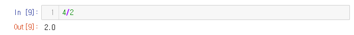
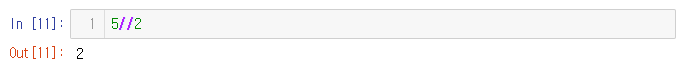

# 191217 빅데이터 수업 개요, 파이썬 기초


## 빅데이터 수업 개요


### 취업 관련

* 포트폴리오는 여러개를 만드는 것이 좋다

* 강화 학습 관련해서 채용이 많이 있지는 않음 하지만 베이스가 되어있는 상태에서 강화학습을 할 줄 알면 매우 희소성있어짐

* 자격증은 큰 판별 기준이 되진 않음 - 정보처리기사는 좀 도움이 됨

* 1년 있다 나오는 것은 경력이라 볼 수 없음 (오히려 마이너스) / 프로젝트를 진행한 것은 OK

* [Kaggle](https://www.kaggle.com/) , Github 관리 잘하면 내 경력이 될 수 있음

  

### 배우는 내용 관련

* 수업 5~6시간정도 진행 후 2~3시간은 과제

* **파이썬**

  1) numpy, pandas를 이용한 데이터 분석

* **R**

  1) 자연어처리

  2) 머신러닝

  3) 데이터 분석

  

* 파이썬 -> 데이터 모델링 -> R 정도의 순서로 진행될 예정 (+ 챗봇, 데이터 수집 등)

* 데이터 수집의 어려움

  1. 저작권, 법적 문제 없이 데이터를 수집하는 것
  2. 정시긍로 데이터를 파는 곳도 별로 없음
  3. 정확한 결과를 얻을 수 있는 질 좋은 데이터를 얻기 힘듬

* CNN 관련 수업 진행  (이미지 처리 기술 중 hot 한 것 = YOLO)

* TEXT 메일 분류기(스팸)

* 데이터 간 상관분석 -  주로 피어슨 상관계수 많이 사용 (공분산 개념 선행)

* PCA TSNE - 차원축소 (고유값 개념 선행)

* 벡터, 행렬에 대한 이해 - 특히 행렬의 내적, 벡터의 내적

* 선형 대수 -> 데이터 전처리

* 알고리즘 - 트리쪽 관련해서 얘기할 예정 (몬테카를로 탐색 기법 / 트리에서 가지치기 하는 것)

* 하둡 관련 수업 (잠깐 특징 정도만) - 분산처리 환경 (Hadoop, Spark)

  

## 파이썬 환경 세팅

1. 아나콘다 다운로드

   [아나콘다 사이트](https://anaconda.com/) 에서 Download > Windows > Python 3.7 다운로드 > default 옵션으로 next눌러 설치

2. 시작 메뉴에서 아나콘다 파일 (생성됨) 누르면 jupyter notebook 클릭

   * Jupyter notebook : 실제 파이썬을 실행할 프로그램

3. 파일 탐색기 > C 드라이브 > 사용자  > student 폴더가 디폴트로 Jupyter notebook에 등록됨

4. jupyter notebook > Downloads 폴더 클릭 > 오른쪽 상단에 `NEW` 버튼 클릭 후 `Python 3` 클릭 = 새로운 파이썬 코드 파일 생성 (Downloads 폴더에 만드는 이유는 딱히 없음 강사님이 편해서)


## 교수님 소스코드 공유 카페

[빅데이터, 머신러닝, 딥러닝](https://cafe.naver.com/ai4you) 들어가서 가입하기 / 따로 다시 카테고리 만들어주신다 함


## Jupyter notebook

### 기본

* 한 칸(줄)을 "셀"이라고 함

* Web 환경

* 바로 test 가능

* 제목 클릭 하면 수정 가능

* 폴더 관리가 힘들 것 같으면 새로 폴더를 만들어서 저장하거나 하면 됨

* url 부분에서 파일 주소 확인할 수 있음

* 파일 확장자 : `.ipynb` 

* 주피터에서는 print문을 따로 작성하지 않아도 출력이 됨

* But 파이참에서는 print문을 꼭 작성해야 출력이 됨

* 한 셀에 여러 문장을 쓰더라도 print는 가장 마지막 문장이 됨

* 셀 안에 있는 문장을 모두 출력하고 싶으면 print 문법 사용해서 표시해주기

  

### 메뉴

#### File

- New notebook : 새로 생성

- Open : 기존에 있는 것 열기

- Save as : 다른 경로나 다른이름으로 다시 저장

- Download as :  파일 확장자 변경해서 다운로드

  ex) .py는 파이참으로 파일열때 예쁘게 열 수 있음

  Git hub에도 바로 보내서 관리할 수 있음

#### Edit

#### View

- line number 가 보이도록 설정해주면 좋음! (Toggle line number 선택)

#### Insert

- 새로운 셀을 어디에 추가할 것인지 선택가능

#### Cell

- 보통 키보드 단축키로 사용

#### Kernel

* 갑자기 멈추거나 했을 때 사용하면 좋음

#### Widgets


### 실제 실행  (Sell)

* Sell을 실행할 때는 **Shift + Enter**
* Sell 밑에 바로 붙어서 결과가 출력됨
* 오류 문법 일 때 Error 문구가 뜸, 어떤 에러인지 이름, 상세 내용과 어디서 에러가 났는지 확인해야 함


### 메모 방식

1. 긴 문자열 필요 시 """ """ 사용

```python
"""를 세번 치면 """  """ 생기며 안에 넣는 내용은 문자열로 인식함 
```

2. 코드 부연 설명 : Comment sentence 주석문 (비실행문)

``` python
# 앞에 샵을 붙이면 주석문, 코드 부연 설명시 주로 사용
```


## 수업 진행 시 주의 사항

** 강사님이 혼용해서 사용하시기 때문에 주의

자료(데이터)

자료형(자료 타입, 데이터 타입)


## 파이썬 자료형

> 코드 부분에 `=`은 이해를 돕기위해 print되는 것을 적어놓은 것
>
> 실제로 저렇게 나오지 않음 (주의)

### 숫자 자료형 

​	정수, 실수 복소수

​	정수와 실수 위주로 학습

​	계산 할 때 엄청 큰 수를 서로 곱하는 등의 작업을 해도 모두 표현이 됨 (메모리만 받쳐주면 다 계산 가능)

* 덧셈 `1 + 1`

* 나누기 : `/` 를 이용해서 표현

  정수 / 정수 => 실수가 나올 때는 (파이썬 3 버전에서는 실수로 나옴 / 파이썬 2 버전에서는 정수로 나옴)

  정수 / 정수 => 정수 더라도 파이썬 3 버전에서는 소수점까지 나옴 ex) 2.0

  

  `//` 연산자 : 소수점 이하를 버림

  

  `%` 연산자 : 5%3 => 5를 3으로 나눈 나머지 출력

  ```python
  5%2 => 2
  ```

  ** 4//2 의 값과 4//2.0값 차이

  ```python
  4//2 = 2
  4//2.0 = 2.0
  # 둘 중 하나라도 실수면, 실수 값이 출력됨
  # 정수 2와 실수 2.0은 다른 것!!
  ```

  ** 4.1//2.0 과 4.1//2.5

  ```python
  4.1//2.0 = 2.0
  4.1//2.5 = 1.0
  # 소수점 부분이 절삭 됨 ()
  ```

  **  숫자 % 2  == 0  / 숫자 % 2 == 1 해서 홀수 짝수 나눌 때 사용 많이 됨

* 곱셈 : `*`으로 표현

  거듭제곱 : `**` 으로 표현

  ```PYTHON
  2*3 = 6
  2**10 = 1024
  ```

* 실수 -> 정수로 변형 / 문자로 된 숫자를 정수로 변경(data type을 다른 type으로 변경)

  정수 = `int` / 실수 = `float` / 문자 = `str` (string의 약자)

  ```python
  int(3.14) = 3
  ```

  ```python
  int(('9')) = 9
  # 진짜 문자는 안됨, 숫자가 문자형태로 쓰인 것만 int 로 변형 가능
  ```

  ** type이 어떤지 확인하고 싶을 때는? `type` 함수 사용

  ```python
  type(3.14)
  type('9')
  type(int('9'))
  # 위 세개를 주피터 노트북에서 프린트해보자
  ```

* `divmod(a,b)` 함수

  ```python
  divmod(7,3) = (2,1)
  # divmod 함수를 사용하면 (몫, 나머지)로 출력
  # "tuple type"으로 프린트 됨 (type(divmod(7,3)) 프린트 해보기)
  ```

  ** 소괄호로 묶여 있으면 Tuple(튜플)형태라고 보면 됨
  
  ​	튜플 자료에 대한 접근
  
  ```python
  x = divmod(7,3) 의 결과가 (2,1)로 나옴
  x[0] = 2		# 결과 x의 0번째 수
  x[1] = 1		# 결과 x의 1번째 수
  ```

* 변수에 자료형 배정

  ```python
  a = 3 # a는 변수 (데이터를 저장하는 장소)
  a = 2 # 프로그램은 위에서 아래로 실행되기 때문에 맨 마지막 문장이 최종적으로 값으로 설정됨
  a,b = 1,2 # a = 1, b = 2, 값이 할당 됨
  ```

* 참고사항

  * `0b111` - `0b` : 2진수
  * `0o10` - `0o` : 8진수
  * `0xF` - `0x` : 10진수

* 실수 오차

  ```python
  4.3-2.7
  4.3-2.7 == 1.6 이 False가 나옴
  # 1.6이 나와야 하지만, 1.5999가 나오는 이유는 실수 표현에 오차가 있기 때문
  # 부동 소수점에 대한 표현 문제 - 근삿값 형태로 출력됨
  # 오차에 대한 전처리가 필요함
  ```

  ```python
  # 오차 해결방법
  import math, sys
  # math : 수학 연산과 관련된 함수들의 집합
  # sys : system과 관련된 함수들의 집합
  x = 0.1 + 0.2
  
  #1) 파이썬 2 ver에서는 사용 but 너무 복잡해서 3.7ver에서는 사용하지 않음
  sys.float_info.epsilon # 2*10의 16승 반올림 오차의 상한값
  math.fabs(x - 0.3)
  # math 패키지의 fabs 함수 : ()값의 절댓값
  # sys.float_info.epsilon 값보다 같거나 작은지 확인해서 더 작으면 오차가 매우 작다고 판단
  math.fabs(x-0.3) <= sys.float_info.epsilon
  
  #2) python 3.7 ver에서 사용 가능 2.7 ver에서는 사용 불가
  math.isclose(0.1+0.2, 0.3)
  # a, b가 서로 가까이 있으면 True, 그렇지 않으면 False를 반환하는 함수
  ```

  **패키지에 있는 함수 찾고 싶을때는 패키지 이름과 `.`입력 후 `tab`눌러서 선택하기


* 수의 표현범위

  ```python
  3+4
  3+4.1
  # 표현 범위가 넓은쪽으로 계산 (실수에 정수가 포함됨)
  ```

* 데이터 실수로 변환

  ```python
  int('9')
    # int('9.1')은 실수문자 이므로 int를 적용할 수 없음
    
    float('9.1') # 실수 = float
    float('9.1') + 3 # 연산 가능
  ```

  

### 문자 자료형

> str 형태로 표현
>
> ' ' or " " or """ """으로 묶어주면 일반적으로 문자로 인식
>
> """ """의 경우 내부에서 enter 까지 인식 가능 => \형태로 enter 표현

``` python
x = 'a'
x = "a"
x = """
test
"""
x
```

* " "와 ' ' 혼합 주의 해야 함

  ```python
  x = 'Python's favorite food is egg' (X)
  x = "Python's favorite food is egg" (O)
  ```

* " "를 화면에 출력하고 싶을 때는 `\`를 써보자

  ```python
  say = '"Python is very easy".he says.'
  say = "\"Python is very easy.\".he says."
  say
  
  # 두 방법 모두 동일한 결과를 출력
  # 화면에 출력하고 싶은 " " 앞에 \를 붙여 주면 " "는 그대로 화면에 출력해야 하는 대상으로 인식하여 출력함
  ```

* 문장 기술 시 여러 줄에 걸쳐서 기술해야 하는 상황 (줄 바꿈) = `\n` 사용

  ```python
  x = "you\nneed\npython"
  print(x)
  # 그냥 x로 출력하지 않고 print함수를 써서 출력 (줄 바꿈을 지원해줌)
  ```

* 문자열 연산 : 덧셈

  ```python
  x = 'Python'
  y = ' is easy'
  
  x+y
  # Python is easy 로 출력
  ```

* 문자열 연산 : 곱셈

  ```python
  x = 'Python'
  y = ' is easy'
  
  print(x*2)
  # PythonPython 으로 출력
  ```

* 글자 수 세기 : `len()` 함수 이용

  ```python
  x = "My leg is too short"
  len(x)
  
  # () : 함수, len : 함수 이름
  # len 함수 기능 : 함수에 전달된 값의 길이를 구함
  ```

  ** **함수**

  ​	1) 내장 : 파이썬에 포함되어 있는 함수

  ​	2) 외장 : 파이썬에 포함되어 있지 않은 함수 (패키지를 install - import 하여 사용)

  ** **패키지** (일종의 폴더 역할)

  ​	함수 또는 패키지 들의 묶음

  ​	외장 함수는 패키지에 저장되어 있으므로 사용하기 위해서는 사전에 가져와야 함(import)

  ```python
  import (패키지 이름)
  from library name import pakage name (라이브러리 사용 시)
  ```


### 인덱싱 & 슬라이싱

* 인덱스 : 특정 영역 참조하는 것

* 슬라이싱 : 영역을 잘라내는 것

  ```python
  # 인덱싱 / 슬라이싱 (영역을 나타낼 때 []사용)
  # 둘은 살짝 다른 개념이지만 보통 비슷하게 사용함
  # 파이썬에서 번호는 0번부터 시작
  
  x = "Python is easy. you need python"
  x[0] # 맨 첫번째 index 문자
  x[29] # 29번 index 문자
  x[-1] # 맨 뒤 index 문자
  x[-2] # 맨 뒤에서 두번째 문자
  x[5:] # 5번째 index 문자부터 끝까지 [시작위치 : 끝위치-1] 끝위치 생략 시 default로 맨 마지막 위치
  x[0:30] # 0~29(30-1)번째까지 문자
  
  # easy 단어 indexing
  x[10:14]
  x[10]+x[11]+x[12]+x[13] < 이것도 가능한데 잘 안 씀(지저분)
  
  x[:10] # 0~9번 indexing
  ```

* 인덱스와 슬라이싱을 이용한 값 변경

  ```python
  a = 'Karea' # a -> o
  # a[1] =' o' a에 저장된 문자열의 특정 문자에 대한 변경시 오류
  # 슬라이싱 방법으로 변경 가능
  
  a = a[0] + 'o' + a[2:]
  a
  ```

  